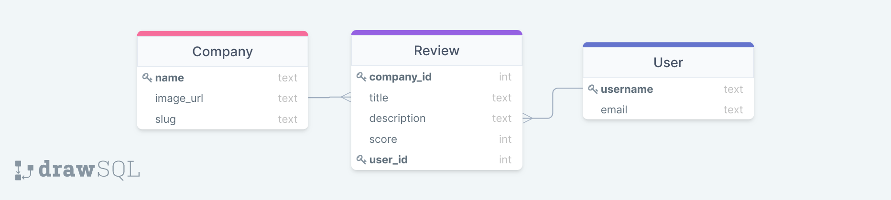

# README

# yuc-company or Your Upcoming Company

Back-end repository, _[here](https://github.com/sokkhengg/back-end-5)_.

# User Stories

Ask a user I can

* See a list of all the companies that I want to work for.
* Add in a new company that I am interested in.
* Write a review for each company.
* Set a schedule to learn more about company later.
* See a list of scheduled company inside calendar page.
* log in and log out.
* After login user can add a company and write reviews on existing company.

# Database relationship diagram

# Demo wireframe design
